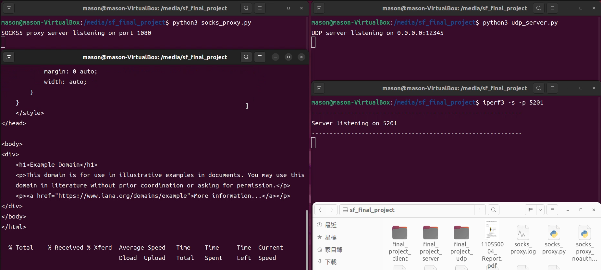

# NSCAP_final
網路系統總整與實作期末
## 檔案說明
- socks_proxy.py: SOCKS5 代理伺服器
- test_cases.py: 13種測試cases
- udp_server.py: UDP 伺服器
- socks_proxy.log: 代理伺服器會記錄各種行為
## 使用說明
### 測試環境建立 (使用 Ubuntu 虛擬機)
1. 按照下圖的方式開啟4個終端機，分別輸入 `python3 socks_proxy.py`, `python3 udp_server.py`, `iperf3 -s -p 5201`
2. 最後一個終端機輸入 `test_cases.py n`，其中`n`代表測試代號，可輸入 1~13
   

